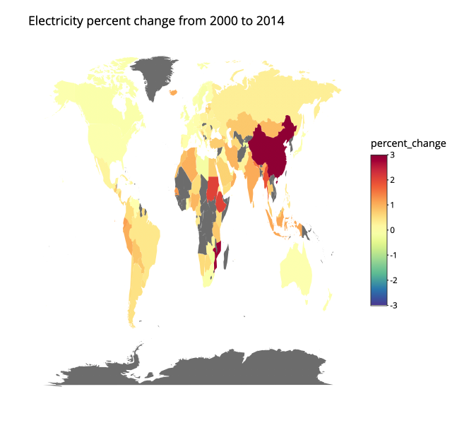

### Visualizations 

This part of the repository contains:
- [R webapp](https://github.com/michellewl/building_resilience/tree/omer/visual/WebApp_Rshiny)   
- R script to create an energy consumption world map 

